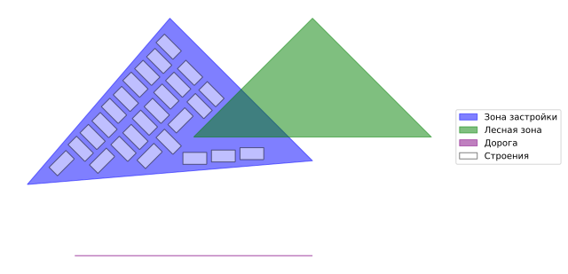

## MindSet: Задачи для стажера-исследователя (урбанистика)

- **Задание:** [\[Markdown\]](/%D0%A2%D0%B5%D1%81%D1%82%D0%BE%D0%B2%D0%BE%D0%B5%20%D0%B7%D0%B0%D0%B4%D0%B0%D0%BD%D0%B8%D0%B5.md)
- **Решение:** [/dev.ipynb](/dev.ipynb)
- Входные данные: [/input](/input)
- Выходные данные: [/output](/output)

 

- Версия Python: [3.11](/.python-version)
- Пакетный менеджер: [uv](https://docs.astral.sh/uv/) / pip
- Установка библиотек: `uv sunc` / `pip install -r requirements.txt`
- Запуск Jupyter Notebook через uv (linux): `./run-uv-jupyter.sh`

### Результат (на примере)

